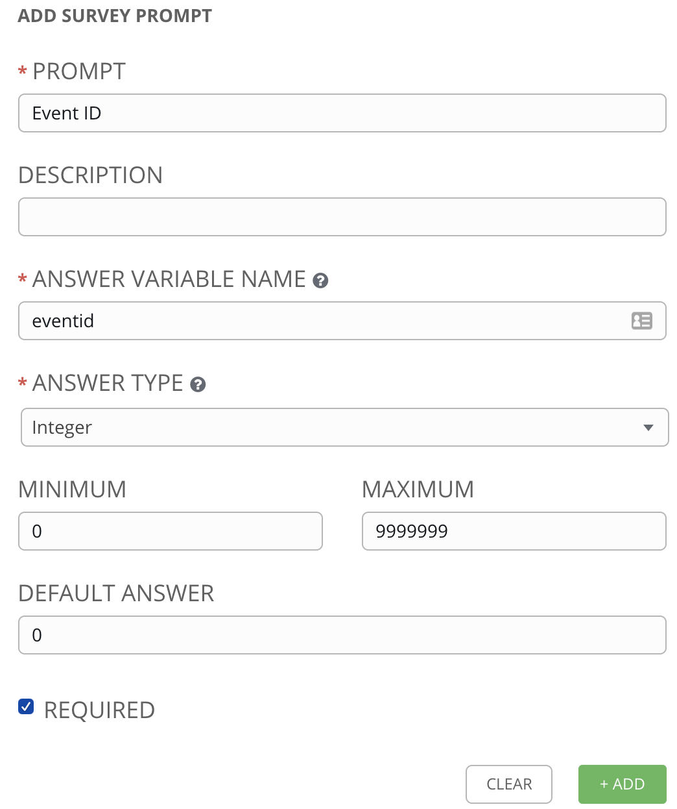
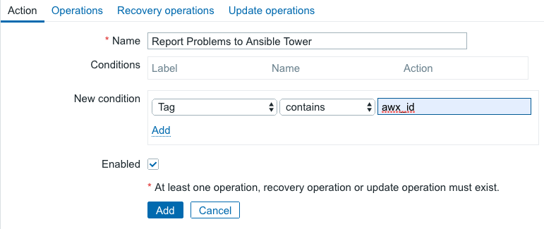
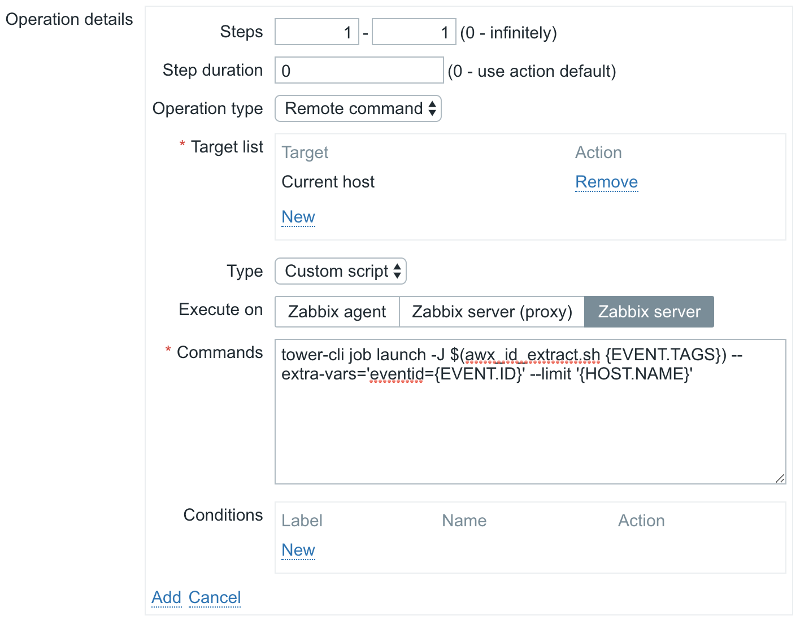
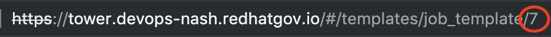
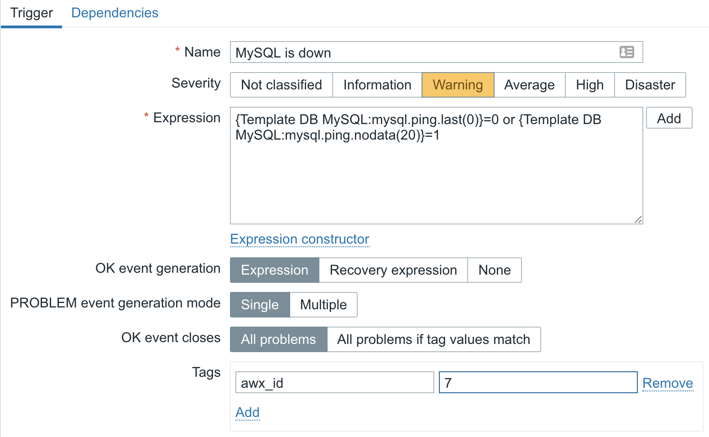
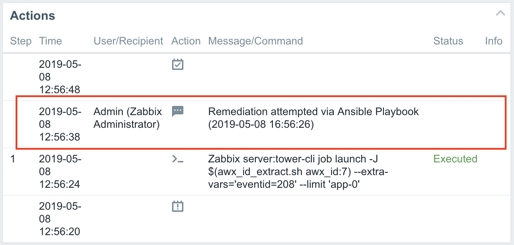

# Demo Procedure

To integrate Ansible Tower with Zabbix, there are only four steps:

1. [Tower - Create Job Template](#create-job-template)
2. [Zabbix - Create Action](#create-action)
3. [Zabbix - Tag a Trigger](#tag-a-trigger)
4. [Profit](#profit)

## Create Job Template

In Ansible Tower we are going to create a job template that will execute the remediation steps for a particular issue. The issue we are focusing on today will be a failure of the MySQL/MariaDB service.

A playbook has already been created for this called [fix_mysql.yml](../app/roles/tower-init/files/fix_mysql.yml). This playbook will do some basic checks on the MySQL service before restarting it and adding a note to the Zabbix event.


Of interest in this Job Template is the Prompt On Launch setting for Limit. This will allow Zabbix to specify which host Tower should operate on when executing this job. Also, in addition to adding the machine credentials to the template, we will want to add the Zabbix credentials. This is a custom credential type that has already been configured.

Once the Job Template has been saved, we will want to add a Survey. This Survey will be used to allow Zabbix to pass the Event ID to Tower. Tower will then use this Event ID to pass data back to Zabbix.



After creating the Job Template, try running it manually on one of the app nodes, like app-0.

## Create Action

Now we need to create an action in Zabbix. This is what will tell Zabbix to call Tower when an incident occurs. To allow Zabbix to communicate with Tower, we will be using the [tower-cli](https://docs.ansible.com/ansible-tower/latest/html/towerapi/tower_cli.html) application. This has already been installed on configured on the Zabbix host.

To create a new Trigger Action, navigate to `Configuration -> Actions` and then select `Triggers` from the `Event source` drop down. Then click `Create action`.

In the `Action` tab, lets name this action `Report Problems to Ansible Tower` and a add a condition the `Tag` contains `awx_id`. The catch here is that we don't want Zabbix to call Tower for every incident, only ones with known remediations in Tower. To handle this, we will tag Zabbix triggers with an ID number for their known remediation in Tower.



In the `Operations` tab, we will create a new Operation of type `Remote command`. This operation should target the Current host and Execute on the Zabbix server. Finally, it will use the following script.

```bash
tower-cli job launch -J $(awx_id_extract.sh {EVENT.TAGS}) --extra-vars='eventid={EVENT.ID}' --limit '{HOST.NAME}'
```



Once the Operation has been added, click the `Add` button at the bottom of the menu to add the new Action to Zabbix.

## Tag a Trigger

Now that Tower has been configured to communicate with Zabbix and Zabbix has been configured to communicate with Tower, we can configure Zabbix triggers to kick off Ansible automations.

To do this, navigate to `Configuration -> Templates` and select the `Template DB MySQL` for editing. Navigate to this Template's Triggers and select `MySQL is down`. We are going to add a tag to this trigger called `awx_id` with a value that is the same as the Job Template ID. The best way to get your Job Template ID, is to pull up the Job Template in Tower and pull the integer off the end of the URL in your browser.





## Profit

Now cause some chaos and watch the world fail to burn.

1. Login to one of the app nodes via SSH and kill the mariadb service.
```bash
sudo systemctl stop mariadb.service
```
2. Monitor the Zabbix dashboard for the issue to be reported. Once it is, click the time link to get further issue details.
3. Switch over to Tower to see that the remediation job has been started.
4. Once the job completes, go back to Zabbix and refresh the Event details. Notice the note in the `Actions` pane.

5. Notice that the issue has been resolved and cleared in Zabbix.

## Conclusion

That's it. Now think of all the sleep you'll get back when your phone isn't ringing at three in the morning! Better yet, think of all the other systems you could integrate with Ansible Tower. Integrations will generally follow this same paradigm. The remote system will call the Tower API to initiate an automation that will call back to the originating system's API to report output from the automation. A common target for integration with Ansible Tower is ServiceNow. Workflows in ServiceNow can initiate automations in Tower that report back when they are complete to progress the workflow.

If you did want to take this a step further and closer to production ready, investigate using Dynamic Inventories. You should be doing this anyway, but you could use Zabbix as a dynamic inventory source for Tower. That way, you always know your hosts are correctly populated. I'll leave that as an exercise for the reader.

Now go forth and automate!
